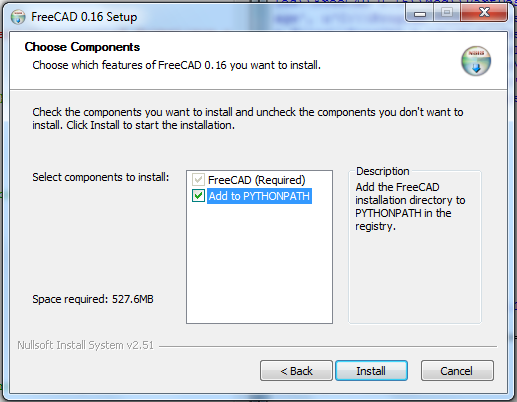

The core of the code is just this::

    import FreeCAD, Part

    in_part = Part.read("in.igs")
    in_part.exportStl("out.stl")

---------------
Troubleshooting
---------------

First, ensure that you have `FreeCAD`_ installed.

.. _FreeCAD: http://www.freecadweb.org/

If you get an error like this::

    Cannot find path to FreeCad.pwd
    Traceback (most recent call last):
      File "./cad2stl.py", line 71, in <module>
        main()
      File "./cad2stl.py", line 68, in main
        convert(args.in_file, args.out_file, args.lib)
      File "./cad2stl.py", line 23, in convert
        import FreeCAD
    ImportError: No module named FreeCAD

then you need to either pass the path to the FreeCAD lib as a flag, like this::

    cad2stl.py --lib /path/to/freecad/lib in.igs out.stl

or add the FreeCAD 'lib' folder to PYTHONPATH.
It will generally be at a location such as
``C:\\Program Files\\FreeCAD 0.16\\lib`` (on Windows)
or ``/Applications/FreeCAD.app/Contents/Frameworks/lib`` (on Mac OS X)
or  ``/usr/lib/freecad/lib`` (on Linux).

-------------
Related links
-------------

- http://jordan.husney.com/archives/2013/07/converting_cad_files_to_stl_us.php

-------
License
-------

This project is licensed under the terms of the `MIT license`_.

.. _MIT license: LICENSE.txt
